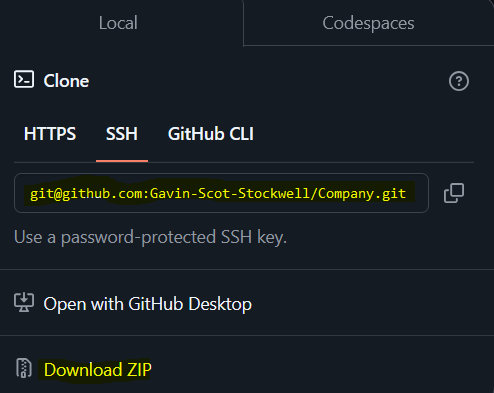

# Company Data

## License

# Table Of Contents
* [Description](#description)
* [Installation](#installation)
* [Usage](#usage)
* [License](#license)
* [Contributing](#contributing)
* [Tests](#tests)
* [Questions](#questions)

## Description
The easy way to update and change company data.

## Installation
How to download
* First go to the github link provided below and click.

* Next click the Code button
* Following that you have two choices
* Either download as a clone in your console with the git command “clone …” with the SSH by copying the link and entering the command OR download directly with the zip file and unzip the file

## Usage
The use is to update and change company roles, departments, employee names plus their ids.

## Contributing
* Gavin Stockwell -ts

## Tests
* Open file “server.ts” in vscode
* Open terminal via right clicking server.ts and click on “Open in Interaged Terminal”
* Follow given instructions from the terminal
* [video how to work app](https://youtu.be/XmuNgnl5d2k)

## Questions
* GitHub-username https://github.com/Gavin-Scot-Stockwell/Company
* Email-address gsstockwell@gmail.com

# Company
